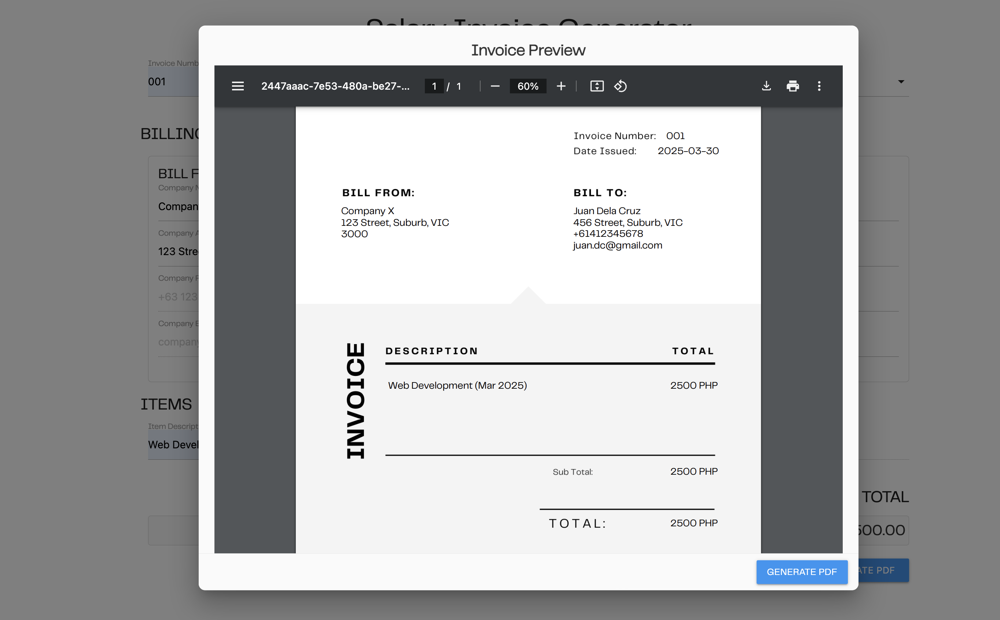
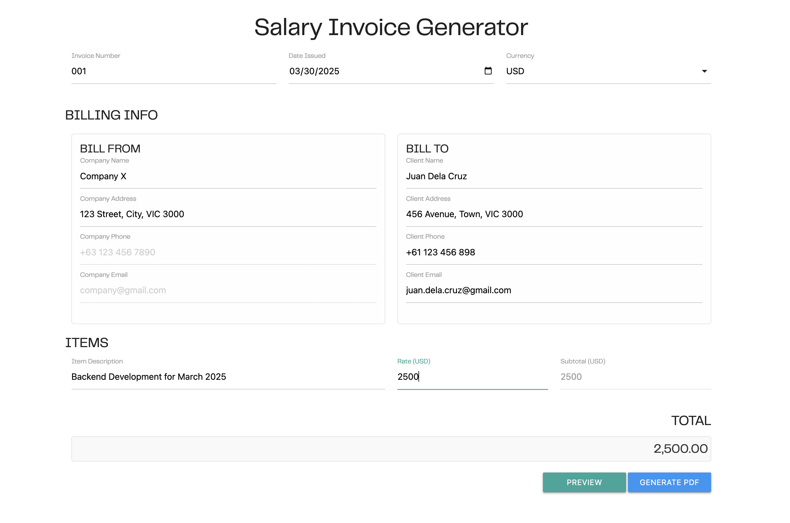

# Salary Invoice Generator

This is a simple web application to generate salary invoices, built using **HTML**, **CSS**, and **JavaScript**.

The app allows users to input relevant information, preview the invoice, and download it as a PDF.

📄 **Live Demo:** [Invoice Generator on GitHub Pages](https://apriilbee.github.io/InvoiceGenerator/)

---

## Features

✅ User-friendly interface for entering invoice details  
✅ Preview the generated invoice before downloading  
✅ Download the invoice as a **PDF** file  

---

## Screenshots

| Preview Page | Sample Input |
| --- | --- |
|  |  |

---

## How to Use

1. Open the app in your browser: [Invoice Generator](https://apriilbee.github.io/InvoiceGenerator/).
2. Fill out the required fields (like employee name, salary, date, etc.).
3. Click the **Preview** button to see how the invoice will look.
4. Click the **Download** button to save the invoice as a PDF file.

---

## Technologies Used

- **HTML**
- **CSS**
- **JavaScript**

